# RedLight Game Engine
a game engine made by me (4tkbytes). contains imgui support, scene creation and built with dotnet 9.0 and Silk.NET. 

# current backends
current backends that are supported: 
- OpenGL
more backends to be added (like DirectX and Vulkan) as I add more to it (if i have the time).

# build
currently, there is no nuget package so you will have to add in the RedLight project and add it to your solution (or if there is another
method available). 

to build this repository (including the editor), just clone it:
```bash
git clone git@github.com:4tkbytes/RedLight
cd RedLight
```
then you build/restore it. you need a minimum of dotnet 9.0. 
```bash
dotnet run --project ExampleGame --Log=1
```

# imgui commands
there are commands you can use on the editor console that will make editing a lot more easier:

```mermaid
graph TD
    clear["clear<br/><span style='font-size:10px'>Clears the console output</span>"]
    help["help<br/><span style='font-size:10px'>Shows available commands</span>"]
    maxwell["maxwell<br/><span style='font-size:10px'>Toggles Maxwell animation</span>"]
    texture["texture<br/><span style='font-size:10px'>Texture manager</span>"]
    texture_add["add<br/><span style='font-size:10px'>Add global texture</span>"]
    texture_delete["delete<br/><span style='font-size:10px'>Delete global texture</span>"]

    model["model<br/><span style='font-size:10px'>Model management</span>"]
    model_add["add<br/><span style='font-size:10px'>Add model</span>"]
    model_delete["delete<br/><span style='font-size:10px'>Delete model</span>"]
    model_texture["texture<br/><span style='font-size:10px'>Model texture ops</span>"]
    model_texture_override["override<br/><span style='font-size:10px'>Override mesh texture</span>"]
    model_texture_list["list<br/><span style='font-size:10px'>List model textures</span>"]
    model_texture_dump["dump<br/><span style='font-size:10px'>Dump model textures</span>"]
    model_texture_add["add<br/><span style='font-size:10px'>Add texture to mesh</span>"]
    model_texture_delete["delete<br/><span style='font-size:10px'>Remove texture from mesh</span>"]

    scene["scene<br/><span style='font-size:10px'>Scene management</span>"]
    scene_create["create<br/><span style='font-size:10px'>Create new scene</span>"]
    scene_delete["delete<br/><span style='font-size:10px'>Delete scene</span>"]
    scene_switch["switch<br/><span style='font-size:10px'>Switch scene</span>"]
    scene_export["export<br/><span style='font-size:10px'>Export current scene</span>"]
    scene_import["import<br/><span style='font-size:10px'>Import scene class</span>"]
    scene_compile["compile<br/><span style='font-size:10px'>Compile scene class</span>"]
    scene_save["save<br/><span style='font-size:10px'>Save current scene</span>"]
    scene_saveas["saveas<br/><span style='font-size:10px'>Save scene as new</span>"]
    scene_list["list<br/><span style='font-size:10px'>List scenes/files</span>"]

    graphics["graphics<br/><span style='font-size:10px'>Graphics settings</span>"]
    graphics_enable["enable<br/><span style='font-size:10px'>Enable feature</span>"]
    graphics_disable["disable<br/><span style='font-size:10px'>Disable feature</span>"]
    graphics_cull["cull<br/><span style='font-size:10px'>Cull face</span>"]
    graphics_frontface["frontface<br/><span style='font-size:10px'>Set frontface</span>"]

    texture --> texture_add
    texture --> texture_delete

    model --> model_add
    model --> model_delete
    model --> model_texture
    model_texture --> model_texture_override
    model_texture --> model_texture_list
    model_texture --> model_texture_dump
    model_texture --> model_texture_add
    model_texture --> model_texture_delete

    scene --> scene_create
    scene --> scene_delete
    scene --> scene_switch
    scene --> scene_export
    scene --> scene_import
    scene --> scene_compile
    scene --> scene_save
    scene --> scene_saveas
    scene --> scene_list

    graphics --> graphics_enable
    graphics --> graphics_disable
    graphics --> graphics_cull
    graphics --> graphics_frontface
```



# todo
- [ ] create a proper readme file
- [x] scene creation
- [x] create a way to make a player. (notes: i made it primitive)
- [ ] add imguizmo and get it working (somehow)
- [ ] add lighting (basic) like the sun
- [ ] add physics such as collisions
- [ ] add networking (if you have the time or are bothered)

# licensing
i dont care what you do as long as you credit me and the engine (and perhaps a lil bit of that moolah if you make some??? no pressure)
